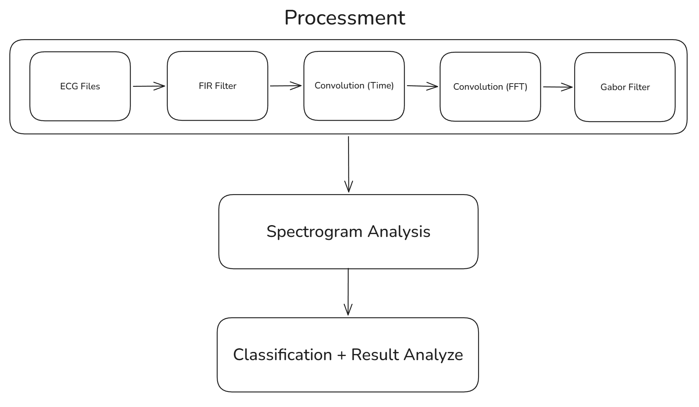

# ECG Signal Analyze

## Objetivo

O objetivo deste projeto é desenvolver e analisar uma pipeline completa de processamento de sinais de ECG, utilizando técnicas de Processamento Digital de Sinais. Especificamente, busca-se investigar a remoção de ruído por meio de filtragem FIR, analisando a equivalência entre a convolução discreta no domínio do tempo e sua implementação eficiente via FFT, e explorar a extração de padrões locais utilizando filtros de Gabor 1D. Adicionalmente, pretende-se realizar a análise do conteúdo espectral do sinal por meio de representações tempo-frequência, como o espectrograma. Por fim, as características extraídas serão empregadas em uma tarefa de classificação de batimentos cardíacos, permitindo avaliar quantitativamente o desempenho do projeto desenvolvido.

## Project Parts

- [ ] 1. Inspeção Inicial do ECG e Caracterização do Problema
- [ ] 2. Pré-processamento e Filtragem
- [ ] 3. Convolução no Domínio do Tempo
- [ ] 4. Convolução Rápida no Domínio da Frequência
- [ ] 5. Banco de Filtros de Gabor 1D
- [ ] 6. Análise de espectro de potência em representação tempo-frequência
- [ ] 7. Extração de Características
- [ ] 8. Classificação

#### 1. Inspeção Inicial do ECG e Caracterização do Problema

O MIT-BIH Arrhythmia Database, desenvolvido entre 1975 e 1980 em uma colaboração entre o MIT e o Beth Israel Hospital de Boston. A base consiste em 48 registros de ECG de dois canais, cada um com 30 minutos de duração, totalizando cerca de 110.000 batimentos cardíacos meticulosamente anotados por especialistas. Os dados, provenientes de 47 sujeitos, incluem tanto amostras aleatórias quanto casos de arritmias raras e clinicamente significativas, digitalizados a uma frequência de 360 Hz com resolução de 11 bits.

Resumo geral:
- Quantidade de registros: 48
- Amostragem: 360Hz 
- Quantização: 11 bits

Para cada registro, há 3 tipos de arquivos.

- .dat: Os arquivos contendo os dados.
- .hea: Os cabeçalhos, indicando frequência e outras informações.
- .atr: Anotações dos médicos, indicando informações importantes.

#### 2. Pré-processamento e Filtragem

#### 3. Convolução no Domínio do Tempo

#### 4. Convolução Rápida no Domínio da Frequência

#### 5. Banco de Filtros de Gabor 1D

#### 6. Análise de espectro de potência em representação tempo-frequência

#### 7. Extração de Características

#### 8. Classificação

#### Referências

- [Documentation for WFDB](https://wfdb.readthedocs.io/)
- [Documentation for SciPy (Signal)](https://docs.scipy.org/doc/scipy/reference/signal.html)